No curso, usaremos uma ferramenta chamada Visual Studio Code (https://code.visualstudio.com/), que é um editor de código desenvolvido pela Microsoft para Windows, Linux e macOS. Caso queira acompanhar os instrutores com as mesmas configurações, reserve um tempinho para a instalação do mesmo.

Para baixar o VSCODE, você pode procurar no Google por Visual Studio Code e clicar no primeiro link que aparece:

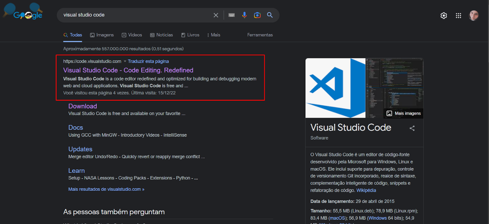

Se o seu sistema operacional for Windows você pode clicar para baixar no botão Download for Windows:

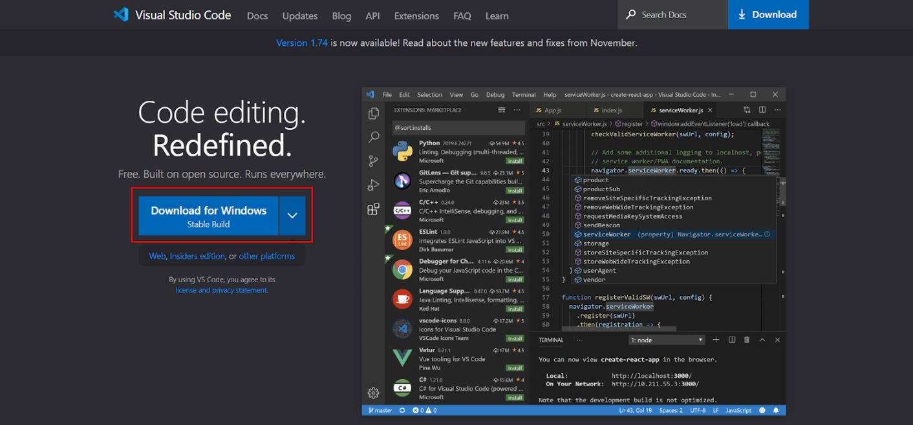

Senão você pode clicar logo abaixo em other platforms (https://code.visualstudio.com/#alt-downloads) que irá abrir uma página com opção de download para Linux e macOS também:

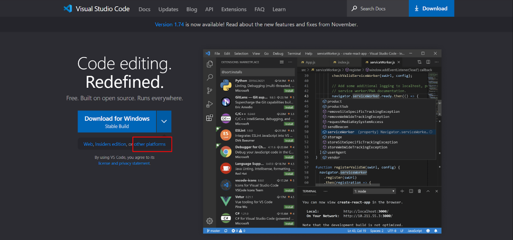

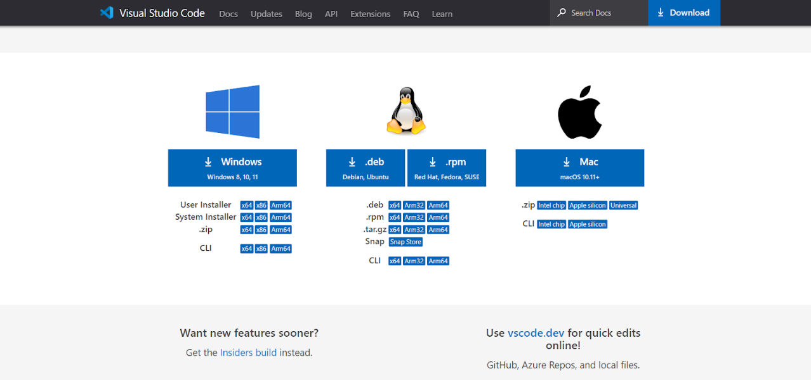

Se o seu sistema operacional for o Windows 8, 10 ou 11, siga os seguintes passos para instalação:

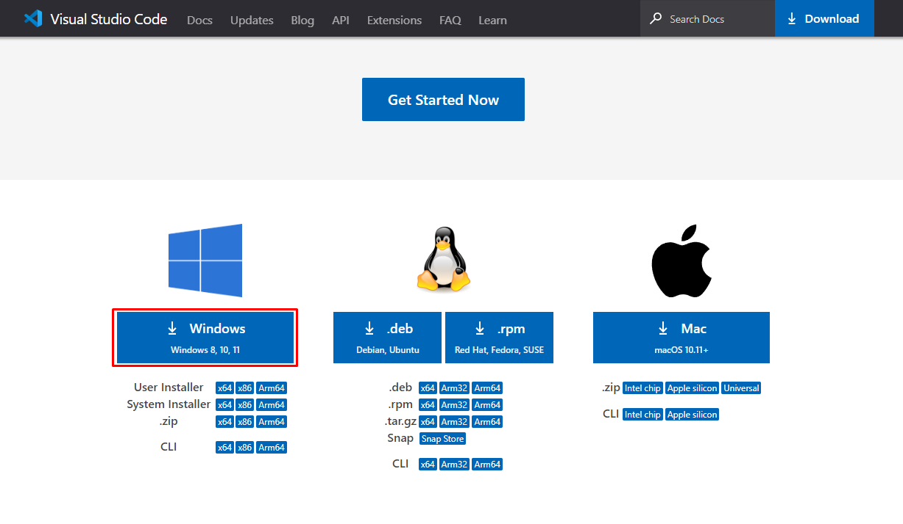

Após clicar na opção de baixar para Windows, o instalador do Visual Studio Code vai para a pasta de Downloads do seu computador. Acesse a pasta, localize o arquivo de instalação, clique com o botão direito sobre ele e “Execute como administrador”.

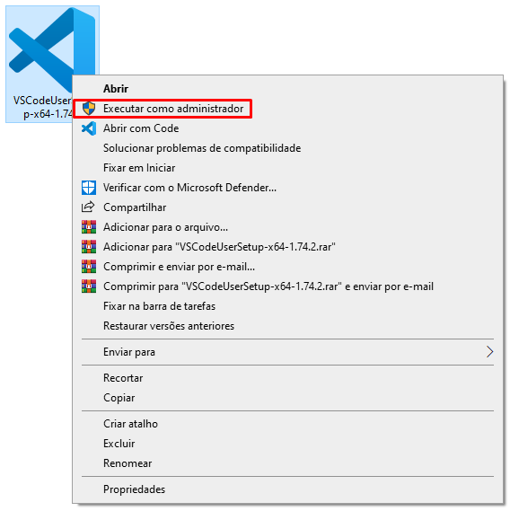

Após aceitar as permissões do Windows para a instalação, o instalador será iniciado e nessa etapa você deve aceitar o acordo de licença para poder prosseguir.

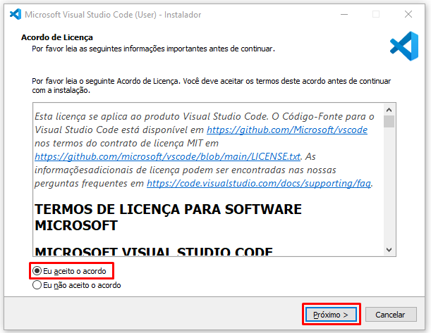

A próxima tela é para você selecionar o local de destino, ou seja, onde o Visual Studio Code será instalado no seu computador. Caso prefira, pode deixar como está sem alterar nada e clique em “Próximo”. Antes de prosseguir com a instalação, é importante lembrar que para poder instalar o Visual Studio Code o seu computador tem que ter o espaço necessário livre.

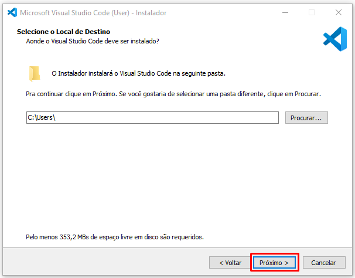

A tela seguinte serve apenas para você decidir se o Windows criará ou não uma pasta do Visual Studio Code no Menu Iniciar, ou seja, no menu que encontramos quando clicamos no símbolo do Windows na barra de tarefas do computador ou até mesmo no nosso teclado. Você pode renomear a pasta se quiser e prosseguir.

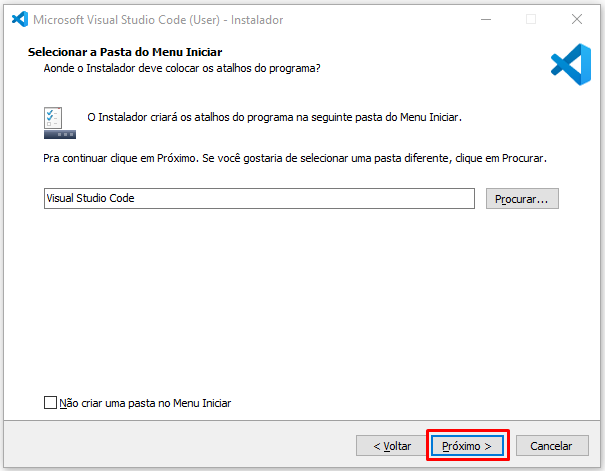

Essa próxima etapa é a seleção de tarefas adicionais que o Visual Studio Code será responsável ou capaz de fazer em seu computador. Recomendamos que marque todas as opções para poder desfrutar das diversas funcionalidades da ferramenta.

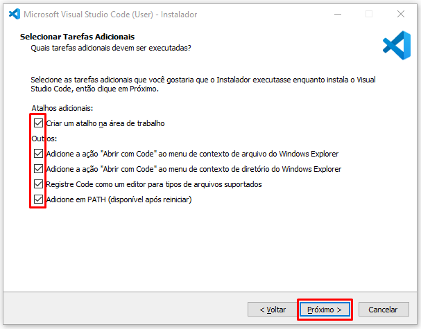

Pronto, chegamos no final da configuração de instalação e agora podemos clicar na opção “Instalar” para executar a última etapa do processo, a instalação de fato.

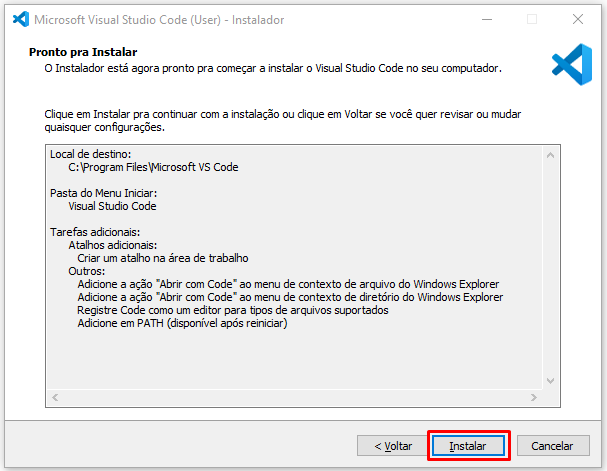

Na próxima tela podemos ver o progresso da instalação, ou seja, da extração dos arquivos baixados para a pasta de destino que selecionamos. Após a barra de extração se completar, podemos prosseguir para a última tela.

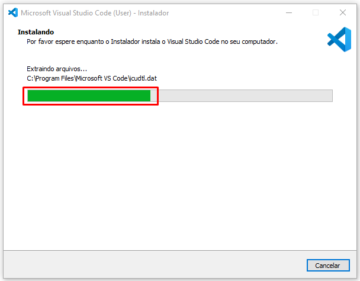

Chegamos na última tela, essa é apenas para informar se o Visual Studio Code foi instalado com sucesso. Você pode marcar a opção “Iniciar o Visual Studio Code” para abri-lo após o fechamento do instalador. Finalmente, ao clicar em “Concluir” o instalador será fechado e todo o processo finalizado. A partir disso você pode usar o VSCode normalmente.

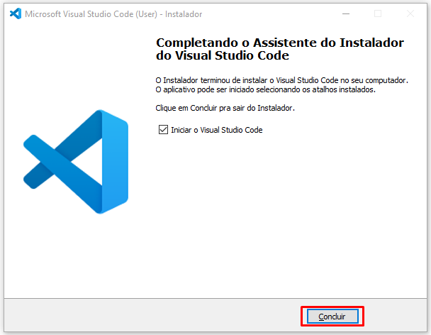

Caso seu ambiente não seja Windows e tenha dúvidas durante a instalação ou no decorrer do curso, pode contar conosco criando um tópico no fórum ou interagindo no nosso servidor do servidor do Discord (https://discord.gg/QeBdgAjXnn). Também não deixe de ajudar outros colegas. Vamos construir juntos essa grande comunidade da Alura? :)
